.. _h1440d1f792019131a433e725675e:

Healthcare Blockly 使用說明
***************************

本文介紹V7版Blockly的方塊意義及使用說明

.. _h507524361a55b2f195d763e73767f36:

資料來源相關方塊
================

這一類的方塊用於定義資料集的來源。有以下三種：

.. _h67342f783615555d721356e132a79:

Block: Patients Data （病患資料集）
-----------------------------------

用途：定義資料集方塊

\ |IMG1|\ 

+---------+-----------------+---------------------+
|         |Required Type    |Note                 |
+---------+-----------------+---------------------+
|Source DB|dataset          |資料來源             |
+---------+-----------------+---------------------+
|Patients |patient_condition|病患條件             |
+---------+-----------------+---------------------+
|         |                 |                     |
+---------+-----------------+---------------------+
|Output   |dataset          |(not implemented yet)|
+---------+-----------------+---------------------+

.. _h22761f63143a4f687b121c34571f337d:

Block: Data Source （資料來源）
-------------------------------

用途：設定資料庫及資料年度

\ |IMG2|\ 

+--------+-------------+----------+
|        |Required Type|Note      |
+--------+-------------+----------+
|Database|database name|資料庫名稱|
+--------+-------------+----------+
|        |             |          |
+--------+-------------+----------+
|Output  |dataset      |          |
+--------+-------------+----------+

.. _h2d66685224272727183465a10122e3b:

Block: Database Options （資料庫名稱）
--------------------------------------

用途：提供Date Source方塊設定資料庫

\ |IMG3|\ 

+-------+-------------+----+
|       |Required Type|Note|
+-------+-------------+----+
|       |             |    |
+-------+-------------+----+
|Output |database_name|    |
+-------+-------------+----+

.. _h2164242e4c6048506f23311549231654:

病患相關方塊
============

.. _h5c7a263d776d5c2e434422283e767e:

Block: Patient （病患條件）
---------------------------

用途：提供Patient Data方塊定義病患條件，系統根據此處的定義從已經歸人的資料來源將符合條件的病人的相關資料紀錄挑出來。

\ |IMG4|\ 

+-------+-----------------+--------------+
|       |Required Type    |Note          |
+-------+-----------------+--------------+
|Profile|profile          |病患的個人特性|
+-------+-----------------+--------------+
|Hat    |hat              |病患的診斷條件|
+-------+-----------------+--------------+
|       |                 |              |
+-------+-----------------+--------------+
|Output |patient_condition|              |
+-------+-----------------+--------------+

.. _h6f587746541e7f775a4b75164578f56:

Block: Profile （個人特性）
---------------------------

用途：設定病患的年齡、性別等個人特性。此病患的年齡為取index_date當日的年齡。

\ |IMG5|\ \ |IMG6|\ 

+-------+-----------------+--------------+
|       |Required Type    |Note          |
+-------+-----------------+--------------+
|Profile|profile          |病患個人特性  |
+-------+-----------------+--------------+
|Hat    |hat              |病患的診斷條件|
+-------+-----------------+--------------+
|       |                 |              |
+-------+-----------------+--------------+
|Output |patient_condition|              |
+-------+-----------------+--------------+

.. _hd7b751276e3b5a272340277219674:

病患診斷條件相關方塊
====================

這一類方塊用於定義與診斷相關的條件，提供Patient方塊設定其病患診斷條件。

.. _h41147b235451d755f7038381734b63:

Block: Hat （診斷條件）
-----------------------

用途：用在病患條件方塊中定義診斷條件

\ |IMG7|\ 

+---------+-----------------+----------------------------------------+
|         |Required Type    |Note                                    |
+---------+-----------------+----------------------------------------+
|Kind     |hat_kind         |診斷類別；住院或門診                    |
+---------+-----------------+----------------------------------------+
|Condition|hat_condition    |診斷碼（例如ICD9）、就醫科別等          |
+---------+-----------------+----------------------------------------+
|Badge    |hat_badge        |尚無合適名稱；定義次數、及次數的發生期間|
+---------+-----------------+----------------------------------------+
|         |                 |                                        |
+---------+-----------------+----------------------------------------+
|Output   |patient_condition|                                        |
+---------+-----------------+----------------------------------------+

\ |IMG8|\ 

用滑鼠點按Hat 方塊的帽子圖示，會顯示出一個選單，有三個選項：

* Set title: 設定此診斷條件的名稱

* Add comments: 設定說明文字

* Add bedge: 增加插槽讓用於限定發生次數的方塊使用

用例：

\ |IMG9|\ 

.. _h2a6c3c35d3f146547497f6873411534:

Block: Hat Kind （診斷類別）
----------------------------

用途：在Hat 方塊中定義診斷類別，有住院、門診及兩者（「住院或門診」都可以）三種選擇

\ |IMG10|\ 

.. _h6f686e2a18652f776c71b2917146a53:

Block: Diagnosis （診斷碼）
---------------------------

用途：在診斷條件方塊中定義診斷碼條件

\ |IMG11|\ 

組合例：

\ |IMG12|\ 

\ |IMG13|\ 

.. _h1c537aa61412b2d41103b3d564667:

Block: Function （科別）
------------------------

用途：在診斷條件中定義就醫科別的條件

\ |IMG14|\ 

組合例：

\ |IMG15|\ 

.. _h3069664864104b2217473221a35725e:

Block: Condition Logic （條件組合）
-----------------------------------

用途：把診斷條件作邏輯組合（AND, OR）

\ |IMG16|\ 

組合例：

\ |IMG17|\ 

.. _h584d4934392c3284f575d1ec54401c:

Block: Not Condition
--------------------

用途：診斷條件的否定條件

\ |IMG18|\ 

組合例：

\ |IMG19|\ 

\ |IMG20|\ 

\ |IMG21|\ 

.. _h7f1265746729754d5e50715d123556e:

Block: Occurrence
-----------------

用途：設定診斷條件的發生次數

\ |IMG22|\ 

.. _h1079d13623328372b736b7c6d4c647b:

Block: Range Occurrence
-----------------------

用途：設定計算診斷條件發生次數的時間區間

\ |IMG23|\ 

組合例：

\ |IMG24|\ 

.. _h587c7b3077512c496c214914e176b2d:

Block: Hat Combination （診斷條件組合）
---------------------------------------

用途：將兩個診斷條件所定義的資料集（病患）作聯集、交集及相減，產生一個新的資料集（病患）

\ |IMG25|\ 

用例：

\ |IMG26|\ 

\ |IMG27|\ 

用滑鼠點按Hat Combination方塊的帽子圖示，會顯示出一個選單，有三個選項：

* Set title: 設定此診斷條件的名稱

* Add comments: 設定說明文字

* Set Index date method: 設定新的資料集取index date的方法

    * min(A,B) 取其中最早的日期

    * max(A,B) 取其中最晚的日期

    * from A 以A（上方）診斷條件的資料集的index date為準

    * from B 以B（下方）診斷條件的資料集的index date為準

.. _h386c1165466936e583a52295a6e4971:

Block: Relative Occurrence
--------------------------

用途：在Hat Combination方塊的B診斷條件中，設定相對於A的發生日期

\ |IMG28|\ 

設定B的發生日

\ |IMG29|\ 

* INDEX-DATE OF B：B的最早一筆診斷紀錄

* ANY B：任何一筆B的診斷紀錄

設定A的發生日與B的發生日比較

\ |IMG30|\ 

* BEFORE A : B診斷資料集的index date（最早日期），需在A的index date之前365天內

* BEFORE ANY A：有任何一個B診斷發生在任何A之前365天內

* AFTER  A : B診斷資料集的index date（最早日期），需在A的index date之後365天內

* AFTER  ANY A：有任何一個B診斷發生在任何A診斷之後365天內

以下是上述八種狀況的圖解：

\ |IMG31|\ 

\ |IMG32|\ 

.. bottom of content

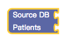

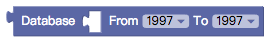

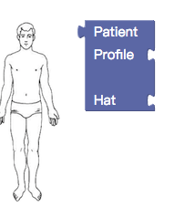

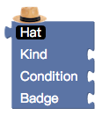

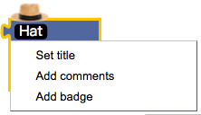

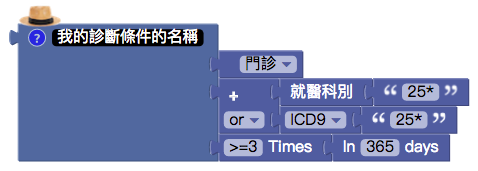

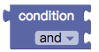

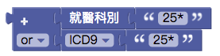

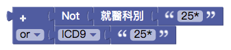

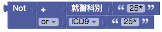

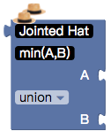

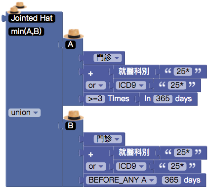

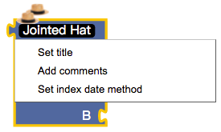

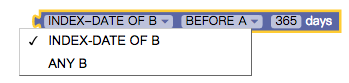

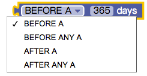

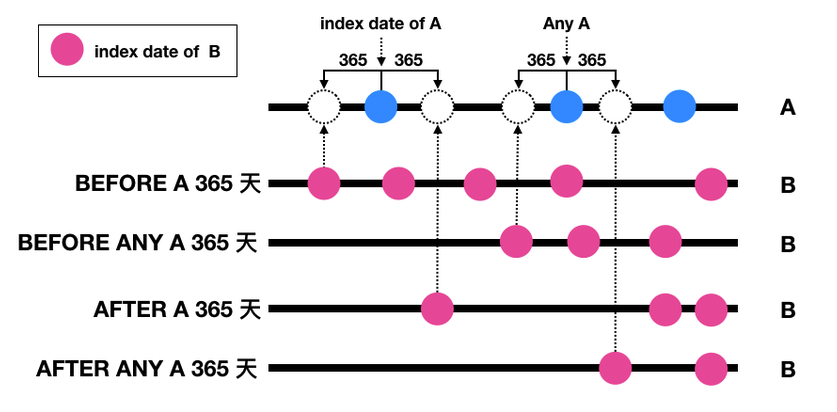

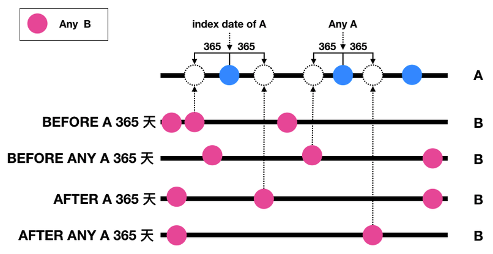
