.. _h2164242e4c6048506f23311549231654:

簡要使用說明
############

查詢方塊的構成有四個主要部分：資料來源、病患、個人特性及就醫紀錄，其位置及主要用途如下圖所示：

\ |IMG1|\ 

.. _h174fb648377959437b5c1f697c1c40:

資料來源
********

\ |IMG2|\ 

.. _h68017771fa7c85ef23567fe7b5a:

病患與個人特性
**************

\ |IMG3|\ 

.. _h68017771fa7c85ef23567fe7b5a:

就醫紀錄的條件
##############

.. _h1f6297237184c3e3d63a1c21277e5f:

Hat -- 以帽子隱喻特定的病患
===========================

\ |IMG4|\ 

.. _h4a6163432a7355a5cd32667c221c7c:

Condition - 設計這頂「帽子」
============================

\ |IMG5|\ 

.. _h68017771fa7c85ef23567fe7b5a:

欄位值比對方式
--------------

\ |IMG6|\ 

\ |IMG7|\ 

.. _h74955164b4769607f6f72333d661876:

Badge -- 修飾這頂帽子
=====================

限定條件發生的次數，及統計發生次數的時間範圍

\ |IMG8|\ 

.. _h5468869351668735c105d7d5a7f46:

加入Badge的方式
---------------

如下圖

\ |IMG9|\ 

.. _h55119325c94f1d532f4f74b411b13:

條件的先後關係 -- 兩頂帽子之間的先後關係
----------------------------------------

\ |IMG10|\ 

.. _h3242d5d5b1c2c4a542a7b4f2820774c:

Login -- 兩個條件的邏輯組合
---------------------------

\ |IMG11|\ 

\ |IMG12|\ 

\ |IMG13|\ 

\ |IMG14|\ 

.. bottom of content

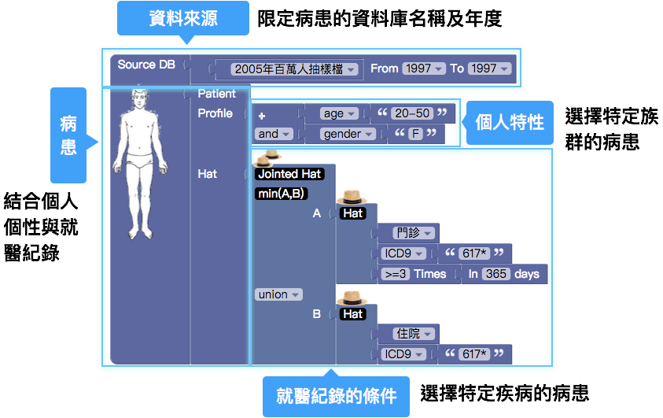

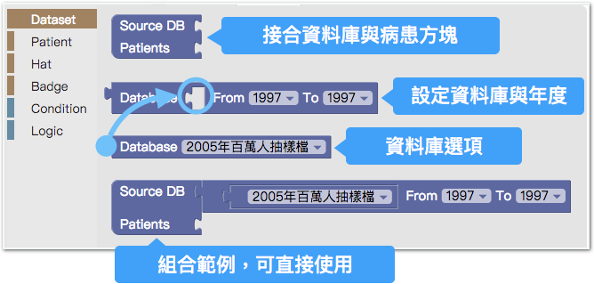

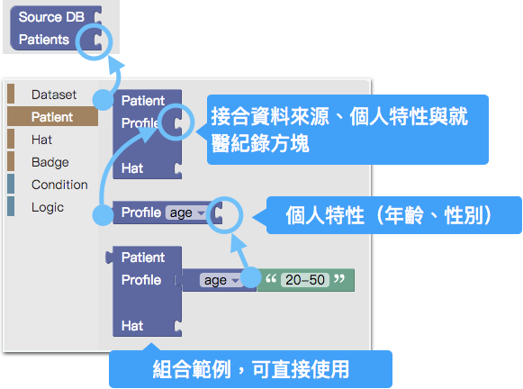

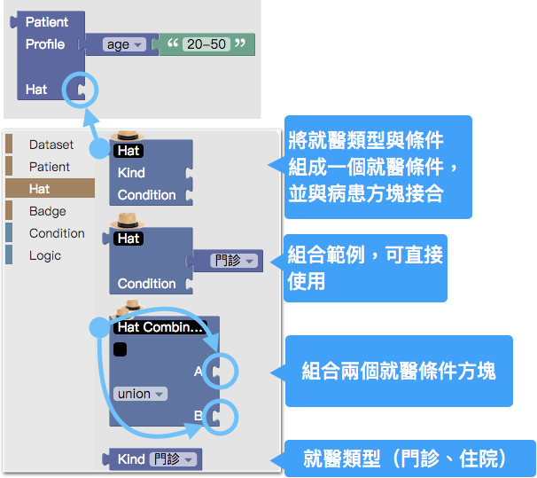

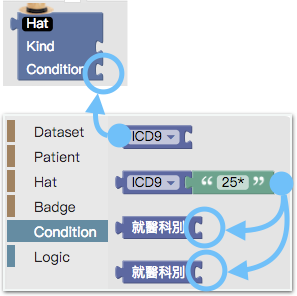

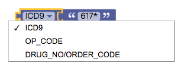

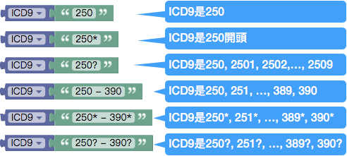

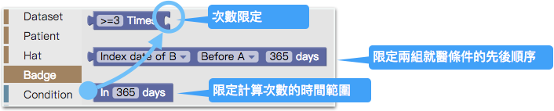

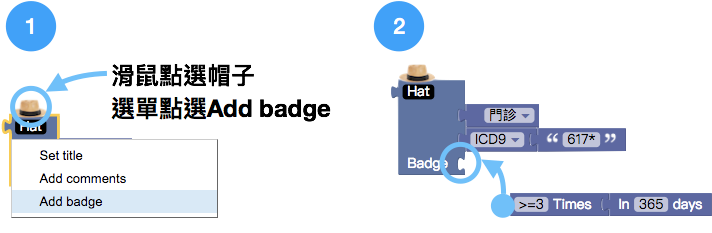

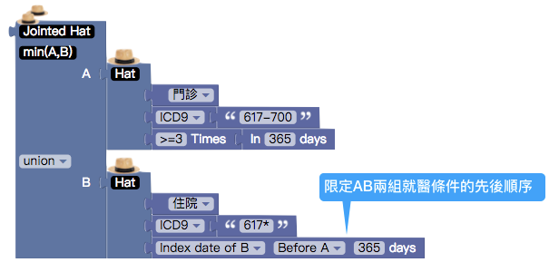

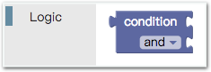

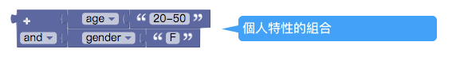

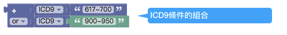

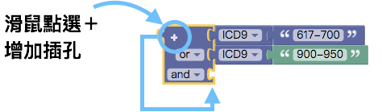
