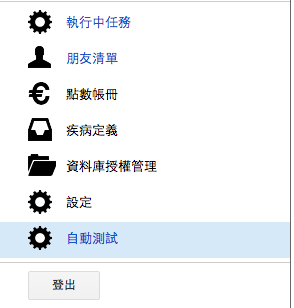
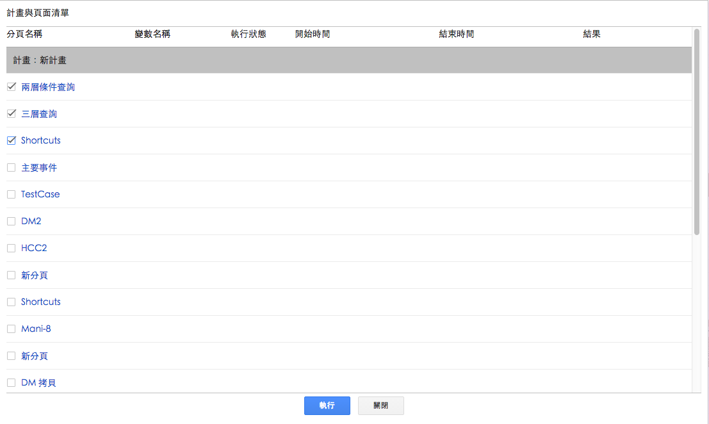

.. _h174fb648377959437b5c1f697c1c40:

自動測試
********

本功能用來一次指定多個任務，自動依序執行。被選定的頁面只有第一個「變數事件」會被自動執行。

.. _h174fb648377959437b5c1f697c1c40:

使用方式
========

.. _h572187820253c7294643631303029:

設定並執行
----------

請利用右上角的選單開始自動測試執行視窗

.. _h2164242e4c6048506f23311549231654:

停止自動執行
------------

.. _h5c462122702e7cc06763134049d56:

重新設定執行的任務
------------------

.. _h5c462122702e7cc06763134049d56:

檢視執行的任務狀態
------------------

.. _h572187820253c7294643631303029:

問題與處理
----------

#. 假設任務A正在執行。此時，設定一個新的自動執行任務，其中包含A。

    #. 如果A為自動執行的第一個任務，則A會被停止，並重新執行。
    #. 如果A為自動執行的第二個任務以後的任務，則A會繼續執行，如果自動執行輪到執行A時，A仍在執行中，則A會被停止，並重新執行。

    如果A為自動執行的第二個任務以後的任務，則A會繼續執行，如果自動執行輪到執行A時，A仍在執行中，則A會被停止，並重新執行。

#. 假設自動測試正在執行任務A，則自動測試被停止時，任務A也會被停止。

